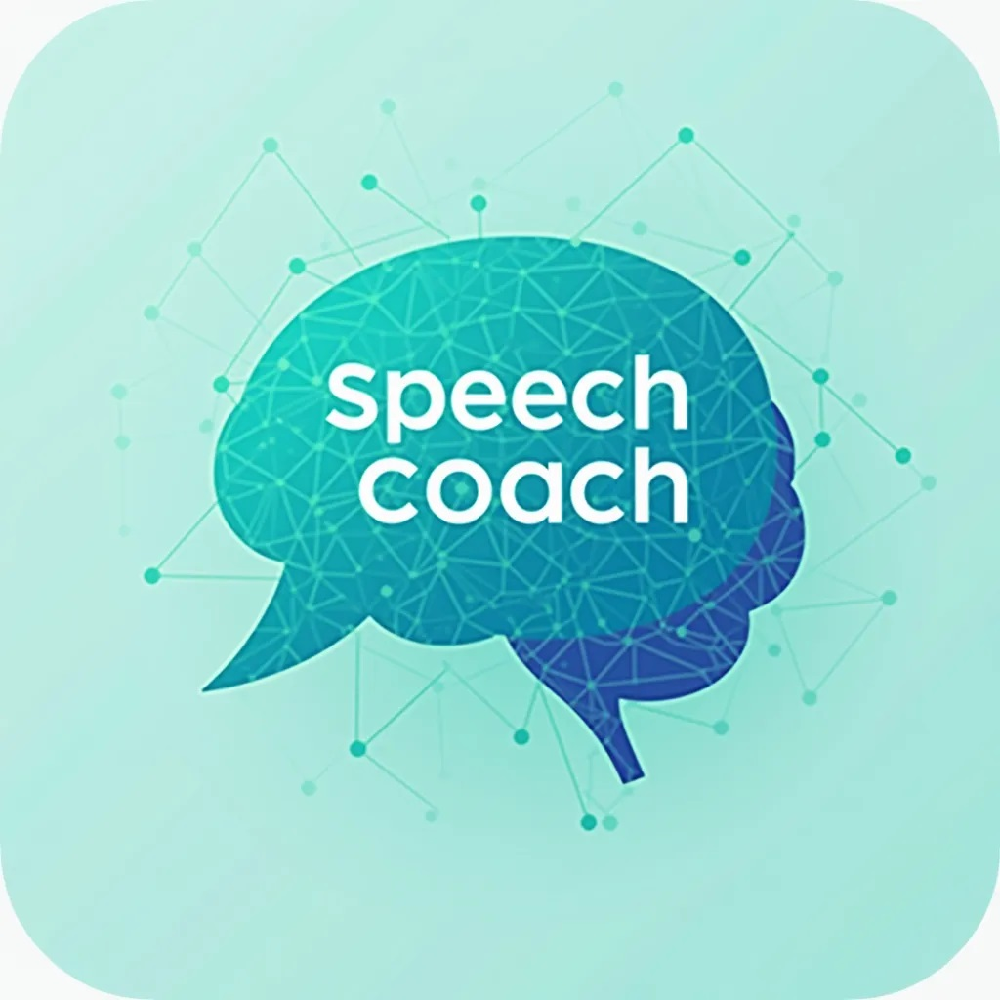

# AI-Speech-Coach
An AI-powered tool providing personalized feedback and guidance to improve articulation and speaking skills

## Sparking the Idea: Video Inspiration

```markdown
A modern, visually clear image representing an AI Speech Coach. A stylized, slightly transparent speech bubble overlaying a subtle, abstract AI brain or neural network. Inside the speech bubble, the text "AI-Speech-Coach" in a clear, sans-serif font. Clean lines, professional, approachable. Color palette: Teal, light grays, and a touch of bright blue to indicate AI. Aim for a friendly, tech-forward design, like an app logo. AI art.

Prompt: google/Gemini 2.0 Flash
Image: black-forest-labs/FLUX.1-dev
```

[](https://www.youtube.com/watch?v=2FTx7DV7sv8)